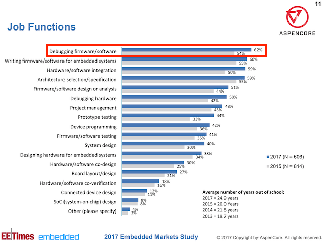
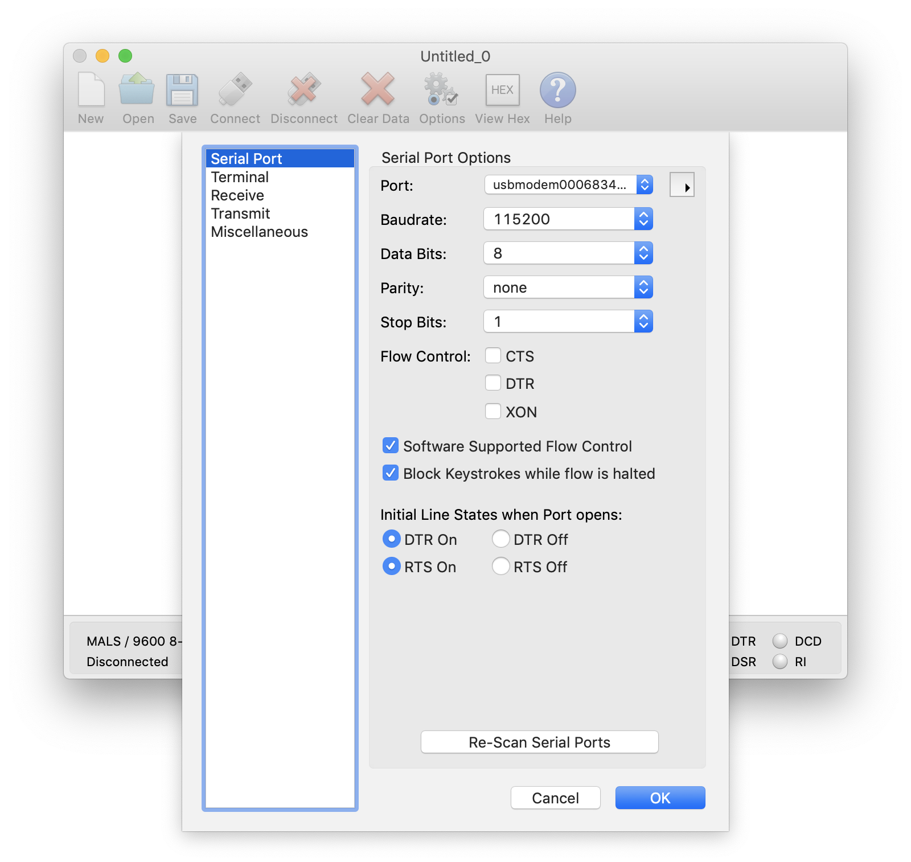

---
title: "Debugging with GDB: Tips & Tricks (nRF52 use case)"
author: mafaneh
---

<!-- excerpt start -->
If I had to choose one significant aspect that I was not aware of before starting my career as a firmware developer, it would be how much time is spent **not actually developing** firmware, and instead **debugging**!

Not convinced? I'll leave you with a few figures taken from the 2017 Embedded/EETimes **Embedded Markets Study** survey which showcase the significance of debugging in the professional life of a firmware developer.
<!-- excerpt end -->

<center>

</center>
<br>

<center>

</center>
<br>

<center>

</center>
<br>

Let's face it..

Debugging is **generally difficult**, and it gets even more difficult for firmware applications and has more limitations compared with a mobile or web application. This is due to a few factors, some of which are:

- Limited availability of resources for debugging. For example, some bugs such as memory corruption are very difficult to diagnose using software breakpoints. In those cases, you would rely on hardware breakpoints and usually there is a limited number of hardware breakpoints for a specific architecture. This makes debugging complex bugs a challenging task.
- Time-dependency in real-time and time-critical applications. For example, setting breakpoints can interfere with the timing of operations and if a bug is timing-related, then the debugging process might cause the bug to disappear.
- Challenges in setting up the debugging environment (cross-platform development environment). There is a variety of visual IDEs and integrated debuggers available, but for some scenarios you may need an automated debugging setup and this can be quite challenging.
- High cost of some debugging tools.

## The GNU Debugger (GDB)
GDB was developed by Richard Stallman in 1986 as part of the GNU system. It is one of the most popular debuggers out there, and for many good reasons!

Some of the most important reasons are:

- GDB supports a vast number of architectures including: ARM, x86, MIPS, and many more. Because of this, a firmware developer's knowledge and expertise with GDB is potentially transferrable across many projects. 
- GDB is command-line based which gives it high flexibility and usability in debugging tasks that require some level of automation. This became especially true with the release of Python support in GDB version 7.0 (in 2011) allowing GDB scripting.
- GDB supports remote debugging. This is crucial for embedded systems where the development environment resides on an architecture different from the target system (e.g. developing on a Windows machine for an ARM-based target). 

Because of these reasons, we believe it is extremely helpful for a firmware developer to at least get **some** exposure to using GDB.

In this post, we'll walk through setting up GDB for the following environment:

- A [Nordic nRF52840 development kit](https://www.nordicsemi.com/Software-and-Tools/Development-Kits/nRF52840-DK)
- A macOS machine as the development environment
- Running an example from the nRF5 SDK (version 15.3.0)
- We'll be running a peripheral example (UART) that does not use Nordic's SoftDevice. Debugging nRF applications with SoftDevice can get much more complicated, so we'll leave that to a later dedicated post.

We'll then go through demos of utilizing the most useful features of GDB to debug our example application.

## Hardware required:
Here's a list of the hardware components required for following the steps in this tutorial:

- An [nRF52840 development kit (PCA10056)](https://www.nordicsemi.com/Software-and-Tools/Development-Kits/nRF52840-DK).
- A macOS machine (though most of these steps are easily transferrable to Linux).
- A micro-USB cable for connecting the development kit to your computer.

## Software required:
Here's a list of the software packages required for following the steps in this tutorial:

- [Nordic Semiconductor's nRF5 SDK](https://www.nordicsemi.com/Software-and-Tools/Software/nRF5-SDK/Download#infotabs) (we'll be using SDK version 15.3.0).
- [Nordic Semiconductor's nRF5 Command Line Tools for macOS](https://www.nordicsemi.com/Software-and-Tools/Development-Tools/nRF5-Command-Line-Tools/Download#infotabs) (we'll be using version 9.8.1).
- [SEGGER J-Link Software for macOS](https://www.segger.com/downloads/jlink/#J-LinkSoftwareAndDocumentationPack) (we'll be using version V6.44g).
- [GNU Arm Embedded Toolchain](https://developer.arm.com/tools-and-software/open-source-software/developer-tools/gnu-toolchain/gnu-rm/downloads) (we'll be using version 7-2017-q4-major which is recommended by Nordic per [this article](https://devzone.nordicsemi.com/b/blog/posts/using-gdb-with-nordic-devices)).
- [CoolTerm serial terminal program](https://freeware.the-meiers.org/CoolTermMac.zip) (or any other serial terminal program).
- Xcode Command Line Tools – [I found this tutorial quite helpful and easy to follow](https://www.embarcadero.com/starthere/berlin/mobdevsetup/ios/en/installing_the_xcode_command_line_tools_on_a_mac.html).

## Setup
In order to use GDB with any embedded system, we need to set up:

- A GDB Server instance which interfaces directly with the target
- A GDB instance that connects to the GDB Server
### Software Installation Steps
Let's go through the different steps for downloading the necessary software packages.

For each of these downloads, you can place them anywhere on your machine. I recommend having them all in a single folder, to make it easier to locate later on.
#### 1. nRF5 SDK
Installation of the nRF5 SDK is straightforward. All you need to do is download the SDK tarball from Nordic's website and then extract it.

**[Link to download nRF5 SDK](https://www.nordicsemi.com/Software-and-Tools/Software/nRF5-SDK/Download#infotabs)**

Once you extract it, you should see the following directory structure:

<center>

</center>

#### 2. nRF5 Command Line Tools
Next, we need to install the nRF5 Command Line Tools. These include **nrfjprog**, which is a tool for programming your nRF52 development kit via Segger J-LINK and needed in our case for working from the command line.

**[Link to download the nRF5 Command Line Tools](https://www.nordicsemi.com/Software-and-Tools/Development-Tools/nRF5-Command-Line-Tools/Download#infotabs)**

First, make sure you select the appropriate operating system (macOS in our case).

<center>

</center>
<br/>

Select the latest version, and then click "Download File".

<center>

</center>
#### 3. SEGGER J-Link
The SEGGER J-Link software is needed for the GDB Server interface to the nRF52 chipset on the development kit.

So let's go ahead and download the software.

[**Link to download SEGGER J-Link Software**](https://www.segger.com/downloads/jlink/#J-LinkSoftwareAndDocumentationPack)

<center>

</center>
<br/>

This download (for macOS) is a .**pkg** installer file. Once you download it, simply double-click it and go through the installation process.

<center>

</center>

#### 4. GNU Arm Embedded Toolchain
The next software package that we need to install is the GNU Arm Embedded Toolchain which includes the compiler (gcc) and debugger (gdb).

**[Direct link to download the GNU Arm Embedded Toolchain (version 7-2017-q4-major)](https://developer.arm.com/-/media/Files/downloads/gnu-rm/7-2017q4/gcc-arm-none-eabi-7-2017-q4-major-mac.tar.bz2?revision=7f453378-b2c3-4c0d-8eab-e7d5db8ea32e?product=GNU%20Arm%20Embedded%20Toolchain,64-bit,,Mac%20OS%20X,7-2017-q4-major)**

<center>

</center>
<br/>

After you download the package, simply extract it to your folder of choice.

<center>

</center>

#### 5. Serial Terminal Program
My choice for a terminal program that I use across projects is a program called **CoolTerm**. What I like about this program is its simplicity and that it supports all the major platforms (Windows, macOS, and Linux).

**[Link to download CoolTerm](https://freeware.the-meiers.org/CoolTermMac.zip)**

For now, all you need to do is download it, open the package and copy the application file to your Mac **Applications** folder so you could launch it later.

#### 6. Adding Necessary Folders to $PATH
In order to access the necessary commands that we'll be utilizing from anywhere in your system, you need to add the paths to the $PATH environment variable.

To do that, open up a Terminal and type the following:

```terminal
$ sudo vi /etc/paths
```

You will be prompted to enter your administrator password. Once you've done that, go ahead and add the following lines to the bottom of the file:

```
<Your Folder>/nRF-Command-Line-Tools_9_8_1_OSX/nrfjprog
<Your Folder>/gcc-arm-none-eabi-7-2017-q4-major/bin
``` 

Make sure to replace the `<Your Folder>` part with the appropriate folder name where you placed those packages.

We don't need to add any paths for the SEGGER J-Link software because it ran as an installer and would have already added the necessary binaries to our system.

After you're done editing and saving the `paths` file, close the Terminal and then start a new session to make sure the updated `paths` file gets loaded. To verify, you can type the following command:

```terminal
$ echo $PATH
/usr/local/bin:/usr/bin:/bin:/usr/sbin:/sbin:/Users/mafaneh/Memfault/nRF-Command-Line-Tools_9_8_1_OSX/nrfjprog:/Users/mafaneh/Memfault/gcc-arm-none-eabi-7-2017-q4-major/bin
``` 

That's it for the setup part, now on to the fun part!

## Running the Example
Before we can actually debug the application and use gdb, we need to build the example and flash it to the development kit.

Following are the steps we need to take:
### 1. nRF52 Example Compilation
In our tutorial, we'll be using the UART example included as part of the nRF5 SDK (version 15.3.0). This example is located at:

```
<nRF5_SDK_Folder>/examples/peripheral/uart/
```

You'll notice there are many subfolders in that folder. We are mostly interested in the following highlighted folder in the screenshot:

<center>

</center>
<br/>

Before we build the example, let's make sure we have the right compiler flags for debugging. This is necessary to include debugging symbols that help gdb better understand and present debugging information to the user. 

To check the compiler flags, edit the `Makefile` located at `<nRF5_SDK_Folder>/examples/peripheral/uart/pca10056/blank/armgcc`. In the file, look for the common C flags section:

```bash
# C flags common to all targets
CFLAGS += $(OPT)
CFLAGS += -DBOARD_PCA10056
CFLAGS += -DBSP_DEFINES_ONLY
CFLAGS += -DCONFIG_GPIO_AS_PINRESET
CFLAGS += -DFLOAT_ABI_HARD
CFLAGS += -DNRF52840_XXAA
CFLAGS += -mcpu=cortex-m4
CFLAGS += -mthumb -mabi=aapcs
CFLAGS += -Wall -Werror
```

Let's modify this to reflect the following changes:

```bash
# C flags common to all targets
#CFLAGS += $(OPT)
CFLAGS += -ggdb
```

We simply commented out the optimization flags and added the `-ggdb` option which includes all debugging symbols needed for gdb.

Now, we can go ahead and build the project. To do this, simply run the following command:

```terminal
$ make
```

The output should look something like this:

<center>

</center>

### 2. Hardware Setup
The second step is to get the hardware set up to run the example.

Here are the steps to accomplish this:

- Connect the development kit to your computer (via the micro-USB to USB-A cable)
- Make sure the development kit jumpers are in the right settings:
	- **SW6** set to "Default" (**not** "nRF ONLY")
	- **SW9** (nRF power source) set to "VDD"
	- **Power** set to "ON"
- Erase the development kit by running the following command:

	```terminal
	$ nrfjprog -f NRF52 --eraseall
	```
	
- The final step is to flash the development kit with the example binary. To do so, run the following command from the folder `<nRF5_SDK_Folder>/examples/peripheral/blinky/pca10056/blank/armgcc`.

	```terminal
	$ nrfjprog -f NRF52 --program _build/nrf52840_xxaa.hex --chiperase
	```
	
That's it!

Now the nRF52840 development kit should be flashed with the UART example and it should be running. To verify that, we will be using a serial terminal program.

### 3. Serial Terminal Program Setup (CoolTerm)
As we mentioned earlier, we'll be using the program CoolTerm.

There are three parts to get this working:

- Run the CoolTerm application
- Make sure the serial port settings are correct (listed at [this link](https://infocenter.nordicsemi.com/index.jsp?topic=%2Fcom.nordic.infocenter.sdk52.v0.9.1%2Fuart_example.html)):\
 
	<center>
	
	</center>
\
	Now, hit **OK**. 

- Finally, connecting to the serial port by hitting the "Connect" button:

	<center>
	
	</center>
	
	You may not see any output since the program probably started before you connected. To reset the development board, we can simply run the following command from the Terminal:
	
	```terminal
	$ nrfjprog -f NRF52 --reset
	```
	
	If all goes well, you should see the following printed in the Terminal window:
	
	<center>
	
	</center>

## Debugging the Program
Now that we have the application running properly, let's go ahead and set up the debugger.

### 1. Remote GDB Setup
There are a few steps to get this working.

- **JLinkGDBServer**
	
	As part of the SEGGER J-Link Software we installed, the program JLinkGDBServer is included. This is the GDB Server application that will interface directly with the development kit and the nRF52840 chipset. It will open up a port (we chose 2331) over the network to allow connections from a GDB client.
	
	To start the J-Link GDB Server, run the following command:
	
	```terminal
	$ JLinkGDBServerCL -device nrf52840_xxaa -if swd -port 2331
	```
	
	The output should look something like this:
	
	<center>
	
	</center>
	
- **Running GDB**

	Now that the GDB Server is running, we have to connect to it from a GDB Client. In our case, the client is the `arm-none-eabi-gdb` program included as part of the GNU Arm Embedded Toolchain we downloaded.
	
	To make things easier, run the following command from the output folder where the binary images for the compiled example are located (`<nRF5_SDK_Folder>/examples/peripheral/uart/pca10056/blank/armgcc/_build/`).
	
	```terminal
	$ arm-none-eabi-gdb
	```
	
	<center>
	
	</center>

	Next, we want to tell GDB what output file is used for the program running on the development kit. We do so with the following command within the GDB console:
	
	```bash
	(gdb) file nrf52840_xxaa.out
	```

	<center>
	
	</center>
	
- **Connecting GDB to the Remote Target**
	
	The last step is to connect to the GDB server:
	
	```bash
	(gdb) target remote localhost:2331
	```
	
	<center>
	
	</center>
	
	The GDB Server (which should be left running in another Terminal window) will show something like the following:
	
	<center>
	
	</center>

### 2. GDB Commands
Now that we've been able to connect the debugger to the nRF52 chipset on the development kit, it's time to start having some fun!

Here are some of the most useful GDB commands that you can use for debugging your application:

**Hint:** In the GDB console, pressing "Enter/Return" on a blank line will repeat the last command called.

#### Help
The first command you should be aware of is the **help** command. You can use **help** followed by any other command to learn everything you need to know about the usage of the command. Or you could simply type **help** in the GDB console to see what options are available

For example, let's run **help** for the "breakpoint" command:

<center>

</center>

#### Breakpoint
The Breakpoint command is used to set a breakpoint at a location telling the debugger to halt the application when the program reaches that line of code. You can use the shortcut **b** instead of spelling out the full name, too.

<center>

</center>

#### Continue
The **Continue** command is used to continue execution after a breakpoint was hit. You can simply use the shortcut **c** instead of spelling out the full word.

<center>

</center>

#### Breakpoints with Condition
Breakpoints are very useful, but sometimes you don't want the application to stop running unless a certain condition has occurred. This is where **Breakpoint with condition** come in.

In our example program, the code at main.c line 175 checks the character sent from the UART to see if it matches the `q` or `Q` character:

<center>

</center>
<br/>

We can set a breakpoint that only stops the program if we receive a  character other than `q` or `Q`, for example: `s`.

```bash
(gdb) b main.c:175 if cr == 's'
```

Now, if we set this breakpoint, we can run the program as normal and then type the character `s` in the CoolTerm program to send this character to the nRF52 chipset. We'll see that the application halts only if that character is sent across the UART.

<center>

</center>

#### Backtrace
The Backtrace command is used to show the call stack of the program at the current pointer. In simple terms, it shows you a summary of how your program got to the point it's currently at.

Here's what the output of **backtrace** looks like when adding the "full" option to show all the local variables as well:

<center>

</center>

If you want to make it look "pretty" with some basic formatting, you could use the following command:

```bash
(gdb) set print pretty on
```

Here's a screenshot showing the difference between the output with "pretty" being **on** or **off**:

<center>

</center>

#### Step
The **Step** command is used to *step* through and execute your source code during debugging. It **will** step into any functions in its path, however it **will not** step into functions that do not contain debugging information.

For reference, here's our code again from main.c:

<center>

</center>
<br/>

Let's take a look at how the Step command behaves after hitting the breakpoint at main.c:175 that we had set.

<center>

</center>
 
Notice that GDB stepped into the function **app_uart_get()** after reaching line 172.

#### List
The **List** command shows the source code for the current Program Counter (PC). The default is to show the source code centered on the PC, with a few lines before and a few after.

Here's an example of using **List** after we hit our breakpoint at main.c:175.

<center>

</center>

#### Info
The **Info** command has many uses, but as the name implies, it is used to display more information for specific elements.

Here are some examples for uses of **Info**.

- **Info locals**: shows information about all local variables.
	
	<center>
	
	</center>

- **Info variables**: shows information about all types of variables (local and global).

	<center>
	
	</center>
	
- **Info files**: shows information about all files being debugged. 
	<center>
	
	</center>

#### Logging
One useful feature within GDB is the ability to log all output to a text file. This makes it much easier to share with others or to simply save the output for later reference.

It's simply done as follows:

- `(gdb) set logging on` to start logging
- `(gdb) set logging on` to stop logging
- The default output log filename is `gdb.txt` and it is saved to the same folder where the execution of gdb was started from.

## Closing and Summary
We hope this post served as a good starting point for using GDB or a refresher if you're already familiar with GDB. GDB is a very powerful tool and has way too many functions and commands that we could cover in a single post!

Some ideas for future GDB-related posts include:

- Debugging nRF52 **SoftDevice-based** applications
- GDB scripting and automation
- Hardware breakpoints vs. software breakpoints

## References and Resources
